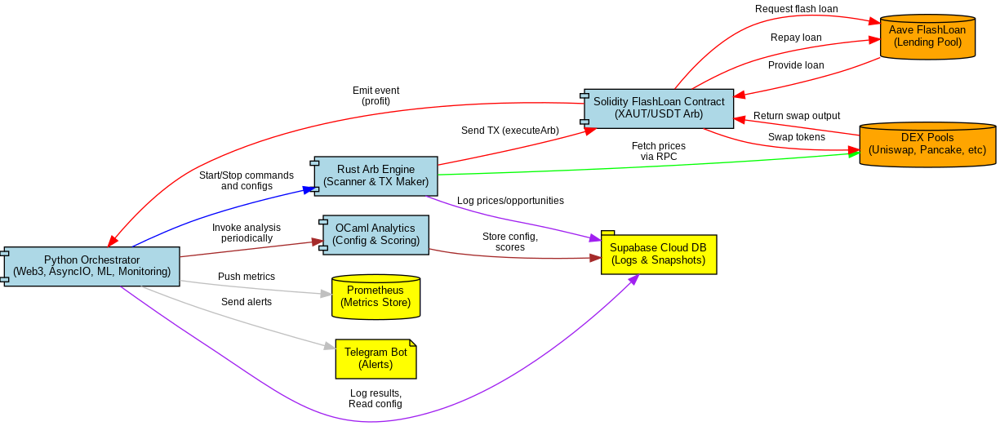
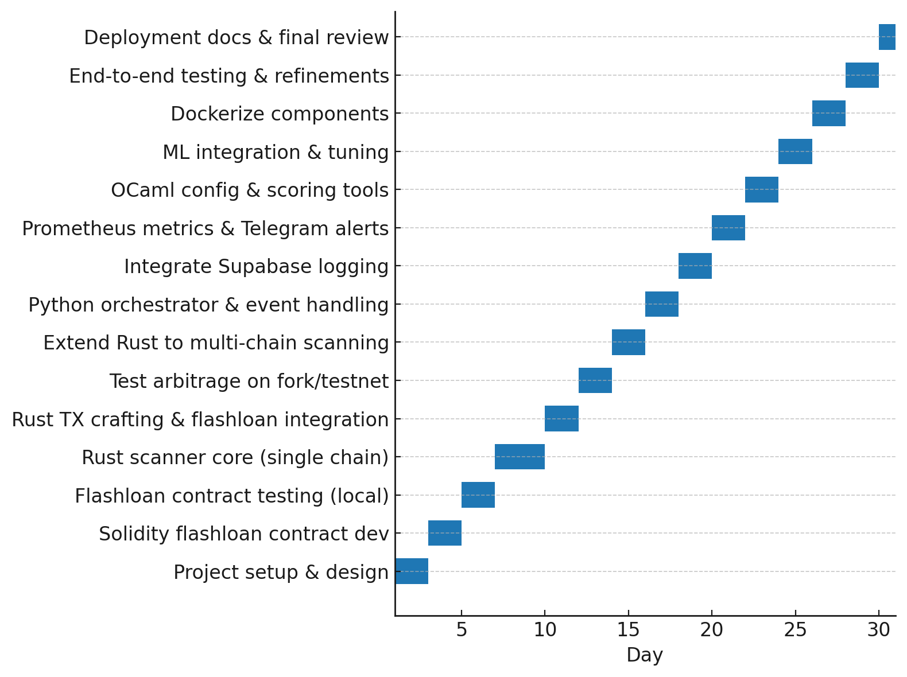

## 🚀 Project Objective
This is a next-gen, production-ready **Flash Loan Arbitrage System** focused solely on the **XAUT/USDT pair** across multiple blockchains and DEXs. Designed for institutional-grade trading, it integrates:

- **Atomic flash loan execution via Aave**
- **Deterministic execution in Rust**
- **High-assurance analytics via OCaml**
- **Real-time orchestration with Python**
- **ML-driven trade filtering and slippage prediction**
- **Free-tier infrastructure for prototyping**
- **Multi-chain readiness with monitoring and alerting**

This system is tailored for professional arbitrageurs seeking sub-second latency, risk-free execution, and modular deployment for institutional scale.

---

## 🧠 Architecture Layers



### 🟤 Layer 1 – Solidity Smart Contract
- Executes atomic flash loan arbitrage in a single transaction
- Compatible with Aave V3 flash loans
- Integrated with:
  - UniswapV2/V3, SushiSwap, PancakeSwap
  - Custom routing logic per chain
- Reentrancy protection (`ReentrancyGuard`)
- Optional oracle TWAP safeguard
- Emits `ArbExecuted` event on success

### 🔵 Layer 2 – Rust Engine (Hot Path)
- Monitors XAUT/USDT pairs on multiple chains concurrently
- Computes arbitrage profitability
- Crafts calldata for smart contract arbitrage
- Signs and broadcasts TX via low-latency RPC
- Utilizes:
  - `tokio` for async runtime
  - `ethers-rs` for EVM interaction
  - In-memory store for price feeds

### 🟠 Layer 3 – Python Orchestrator
- Starts/stops components
- Handles Web3 event subscriptions (contract events)
- ML decision layer for:
  - Slippage prediction
  - Latency-adjusted profitability scoring
- Writes trade logs, opportunities, configs to Supabase
- Sends Telegram alerts & exposes Prometheus metrics

### 🟢 Layer 4 – OCaml Tooling
- Generates DEX pool configs
- Computes optimal arbitrage size per pool
- Provides static safety analysis (e.g. price manipulation detection)
- Outputs config JSON to be consumed by orchestrator

---

## 📦 Directory Structure

```
project-root/
├── contracts/              # Solidity contracts
├── docker/                 # Dockerfiles, Prometheus, Compose setup
├── docs/                   # Docs, images files
├── ocaml_tooling /         # OCaml scripts for analytics & config
├── orchestrator/           # Python orchestrator
├── rust_engine             # Rust-based arb engine
├── scripts/                # Deployment / utility scripts
├── .env.example            # Sample environment file
├── .gitignore              # Python .gitignore template
└── README.md               # This file
```

---

## ⚙️ Setup Instructions

### 1. Clone the Repository
```bash
git clone https://github.com/YOUR_NAME/xaut-arb-bot.git
cd xaut-arb-bot
```

### 2. Prepare Environment Variables
```bash
cp .env.example .env
# Fill in the following fields:
# - RPC_URL_ETH
# - RPC_URL_BSC
# - PRIVATE_KEY
# - TELEGRAM_TOKEN
# - SUPABASE_URL
# - SUPABASE_KEY
```

### 3. Launch Stack (for local dev)
```bash
docker-compose up --build
```

---

## 🔧 Component Details

### 📜 Solidity (contracts/)
- Implements `IFlashLoanReceiver`
- Configurable swap targets (DEX routers)
- Emits logs for off-chain tracking
- Built-in guardrails:
  - Fail-safe if `expectedProfit < minProfit`
  - Slippage constraint
  - TWAP oracle deviation bounds (configurable)

### ⚡ Rust (rust_engine/)
- Hot path engine optimized for sub-second detection
- Detects profitable arbitrage paths by:
  - Fetching AMM pool reserves
  - Calculating best trade amount using AMM math
  - Ensuring post-fee profitability
- Uses `tokio`, `serde`, `ethers-rs`

### 🧠 Python (orchestrator/)
- Watches on-chain events (`ArbExecuted`)
- Logs data to Supabase (`trades`, `failures`, `opportunities`)
- ML Module:
  - `ml.py` → predicts slippage & filters risky trades
- Monitoring:
  - Prometheus endpoint at `/metrics`
  - Telegram alerts for success/failure

### 📘 OCaml (ocaml_tooling/)
- DEX config discovery (factories, pools)
- Trade simulation (model slippage)
- Generates `dex_config.json` consumed by Rust engine

---

## 📈 Logging & Monitoring

| Tool         | Function                           |
|--------------|------------------------------------|
| Supabase     | Database for trades + opportunities|
| Prometheus   | Metrics endpoint for orchestrator  |
| Telegram Bot | Real-time alerts                   |

---

## 🤖 AI Integration (ML Models)
Location: `orchestrator/ml.py`

### Models:
- `predict_slippage(price_gap, liquidity, amount)`
- `score_opportunity(volatility, delay_risk, predicted_profit)`

Run retraining:
```bash
python orchestrator/train_model.py --data logs/trades.csv
```

---

## 🔒 Security Best Practices

- ✅ `nonReentrant` modifier in Solidity
- ✅ TWAP oracle deviation checks
- ✅ OnlyOwner contract gating
- ✅ Hardcoded known-token address mapping
- ✅ Dynamic slippage tolerance
- ✅ Transaction simulation before submission (future)

---

## 🧪 Testing

- **Local Hardhat Fork Test**:
```bash
cd contracts
npx hardhat node --fork https://mainnet.infura.io/v3/KEY
npx hardhat test
```

- **Live testnet sim (optional)**:
Use mock tokens to simulate XAUT/USDT on testnet and deploy contracts.

---

## 📊 Supabase Schema (tables)

| Table         | Description                        |
|---------------|------------------------------------|
| `trades`      | Successful arbitrages              |
| `failures`    | Reverted/failed attempts           |
| `opportunities`| All detected arb opportunities     |
| `config`      | Pool & chain config data           |

---

## 📅 Timeline


---

## 🗺️ Roadmap Highlights

- 🔄 Add Flashbots TX bundling (Ethereum mainnet)
- 📚 Reinforcement Learning based execution model
- 🔗 Cross-chain arbitrage (with bridge latency modeling)
- 🧩 Modular plugin system for strategy backtesting
- 🌐 Web UI Dashboard (Supabase + React)

---

## 📦 Dockerized Services

- `arbbot-rust` — hot-path arbitrage scanner
- `arbbot-orchestrator` — orchestrator & ML
- `prometheus` — metrics scraper
- `grafana` *(optional)* — dashboard visualization

---

## 👨‍💻 Maintainer
**Amir Lehmam** — flash loan arbitrage developer  
Contact: `@fluctue` | `amirlehmam.pro@gmail.com`

---

## 📎 Resources
- [Aave Flash Loans](https://docs.aave.com)
- [Uniswap Docs](https://docs.uniswap.org/)
- [Supabase](https://supabase.com/)
- [Prometheus](https://prometheus.io/)
